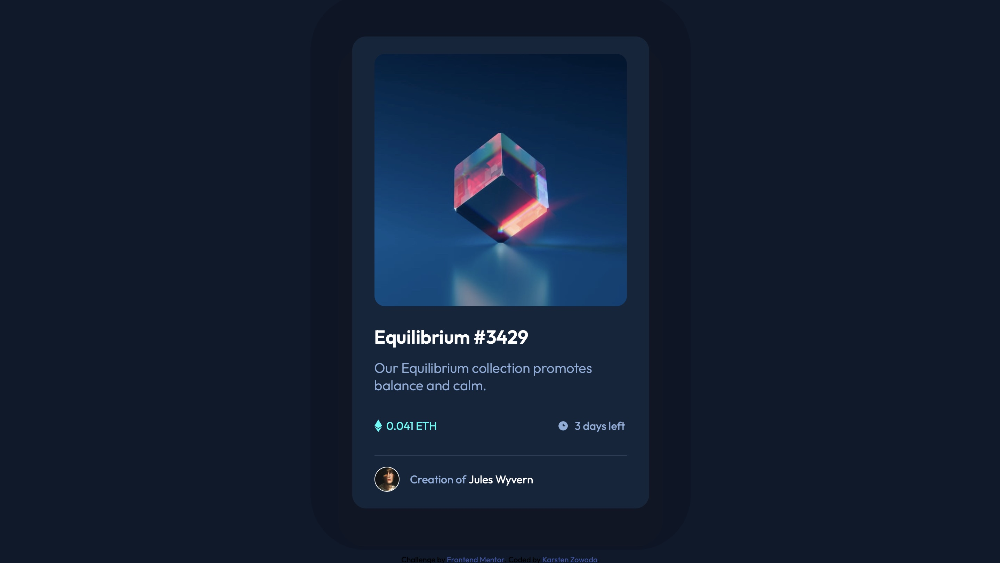

# Frontend Mentor - NFT preview card component solution

This is a solution to the [NFT preview card component challenge on Frontend Mentor](https://www.frontendmentor.io/challenges/nft-preview-card-component-SbdUL_w0U). Frontend Mentor challenges help you improve your coding skills by building realistic projects. 

## Table of contents

- [Overview](#overview)
  - [The challenge](#the-challenge)
  - [Screenshot](#screenshot)
  - [Links](#links)
- [My process](#my-process)
  - [Built with](#built-with)
  - [What I learned](#what-i-learned)
- [Author](#author)

**Note: Delete this note and update the table of contents based on what sections you keep.**

## Overview

### The challenge

Users should be able to:

- View the optimal layout depending on their device's screen size
- See hover states for interactive elements

### Screenshot

### Links

- Solution URL: [Add solution URL here](https://github.com/kzowada/nft-preview-card-component)
- Live Site URL: [Add live site URL here](https://kzowada.github.io/nft-preview-card-component/)

## My process

My process was the same as with my challenges that I did before. First I thought about the inital layout of this challenge and made a rough blueprint of it on a whiteboard. Then I typed the HTML into my Editor. After that I just simply started styling Element after Element with CSS and trying to get the Design right. The colors of the box-shadows are the wrong colors but I couldn't find out how to match the colors from the Design and the provided style-guide wasn't showimg them.

### Built with

- Semantic HTML5 markup
- CSS custom properties
- Flexbox
- CSS Grid

### What I learned

This was actually the first time that I've used the box-shadow property by myself. I'm trying to build on that and from now on implement my own shadows.

## Author

- Frontend Mentor - [@yourusername](https://www.frontendmentor.io/profile/kzowada)